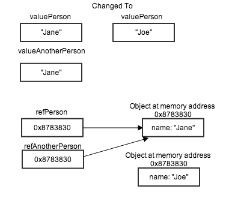

## Objectives
* Know how Javascript is standardized.
* Know the difference between Primitive Types and Objects.
* Know what is a reference type and how it behaves.


## ECMAScript
ECMAScript is the standardization of Javascript.

[ECMAScript Versions](http://en.wikipedia.org/wiki/ECMAScript#Versions)

We are going to use ECMAScript Version 5. There are a lot of new features coming in ECMAScript 6 but many are not available in current browsers.


[WhatBrowser](http://whatbrowser.org)

[ECMAScript 5 Compatability](http://kangax.github.io/compat-table/es5/)

[ECMAScript 6 Compatability](http://kangax.github.io/compat-table/es6/)

## Learn about strict mode and use when you can.

Strict mode will catch more errors, like mistakenly creating globals inside a function when not using var. Helps javascript to adhere to the Principle of Least Surprise.

* "use script" at top of file or at top of function declaration.
* some environments do not enforce strict mode.
* Don't combine strict and non-strict mode files.
* Can be a problem for utils that combing files, like the Rails asset pipeline.
	* Solution may be to wrap all combined files in an immediately invoked function.

[John Resig Strict Mode](http://ejohn.org/blog/ecmascript-5-strict-mode-json-and-more/)

[MDN Strict Model](https://developer.mozilla.org/en-US/docs/Web/JavaScript/Reference/Functions_and_function_scope/Strict_mode)

[Underhanded Javascipt](https://leanpub.com/underhandedjavascript)
## Avoid eval()

It's evil, thats all just bad.


## Always use === and !==

Avoids knowing complex type coercion rules for equality when using double equals, ==.

* == applies confusing set of implicit coercions when args are different types.
* === does *not* apply coercions.

## Single var Pattern for Functions.

* Provides a single place to look for all the local variables needed by the function.
* Prevents logical errors when a variable is used  before it’s defined (see “Hoisting)
* Helps you remember to declare variables and therefore minimize globals.
* Is less code (to type and to transfer over the wire)

Looks like:

```
function func() {
  var a = 1, b = 2, sum = a + b, myobject = {}, i, j;
  // function body...
 }
```

## Primitives
Unlike Ruby, in Javascript everything is __NOT__ an Object. Some values a so basic they don't require the overhead and complexity that are built into Objects.

These are [Primitives](http://goo.gl/plsE6x), aka Primitive Types. And they are simple atomic pieces of data. These are accessed by __value__. Where objects are accessed by _reference_. (More later).

In JavaScript, there are 6 primitive data types:

* string
* number
* boolean
* Null
* undefined
* Symbol _(new in ECMAScript 6)_

### [Primitive Wrapper Objects](PrimitiveWrappers.md)

Some of the javascript primitives have corresponding objects, i.e. wrappers. We are going to avoid the use of these. But, [Here is More Info](PrimitiveWrappers.md) about how primitives work with wrappers.

* String for the string primitive.
* Number for the number primitive.
* Boolean for the Boolean primitive.


## Built-in Objects
* [Object](http://goo.gl/cjziB)
* [Array](http://goo.gl/aeeZI)
* [Function](http://goo.gl/7GVB3)
* [Date](http://goo.gl/DaGfQ)
* [RegExp](http://goo.gl/6e7TJ)

[Built-in Objects](http://goo.gl/jvqc2d)

__Don't add methods to built-in Objects__

## Reference Data Type and Primitive Data Types
One of the main differences between reference data types, Objects, and primitive data types is reference data type’s value is stored as a reference, it is not stored directly on the variable, as a value, as the primitive data types are.

_This is different than Ruby, were everything is stored by reference. But, similar to Java._

##### Primitives are "Stored by Value"

```
var valuePerson = "Jane";
var valueAnotherPerson = valuePerson; // anotherPerson = the value of person
valuePerson = "Joe"; // value of person changed

console.log(valueAnotherPerson); // Jane
console.log(valuePerson); // Joe

```

##### Objects are "Stored by Reference"

```
// Stored by Reference
var refPerson = {name: "Jane"};
var refAnotherPerson = refPerson;
refPerson.name = "Joe";

console.log(refAnotherPerson.name); // Joe
console.log(refPerson.name); // Joe
```

__Step through js/stored_by.js and notice the difference between stored by value and stored by value.__




1. __Run and step through the stored_by.js file.__
