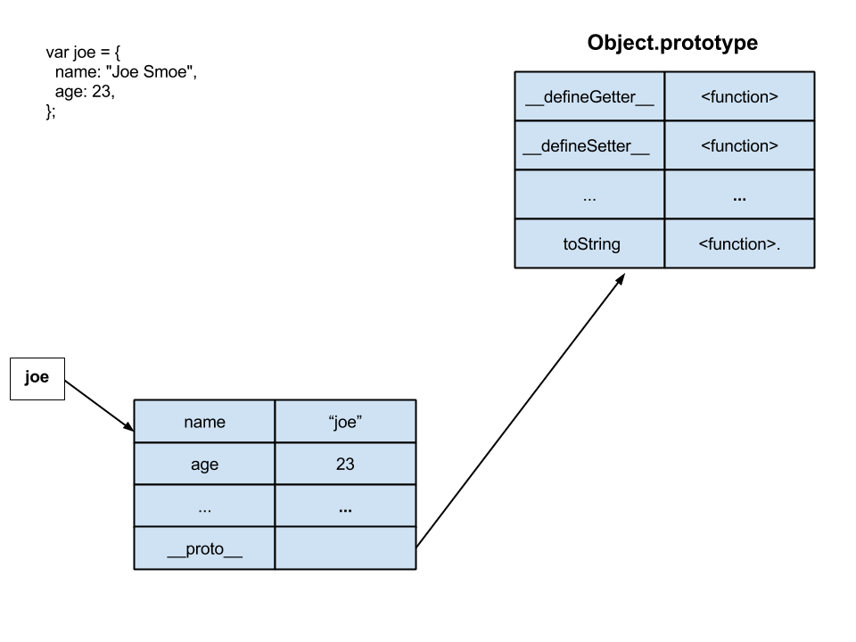
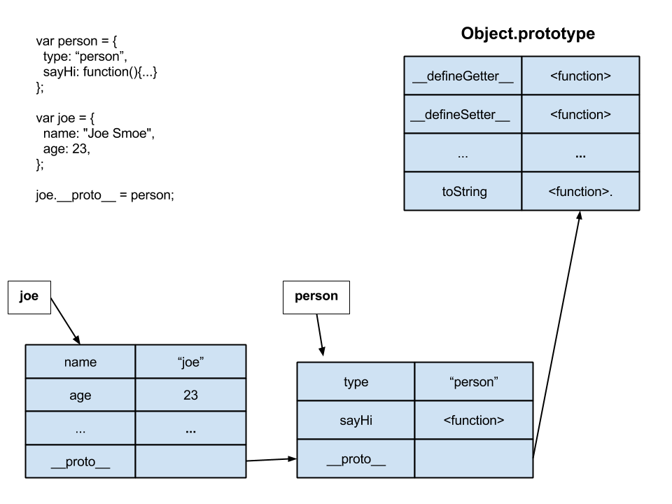
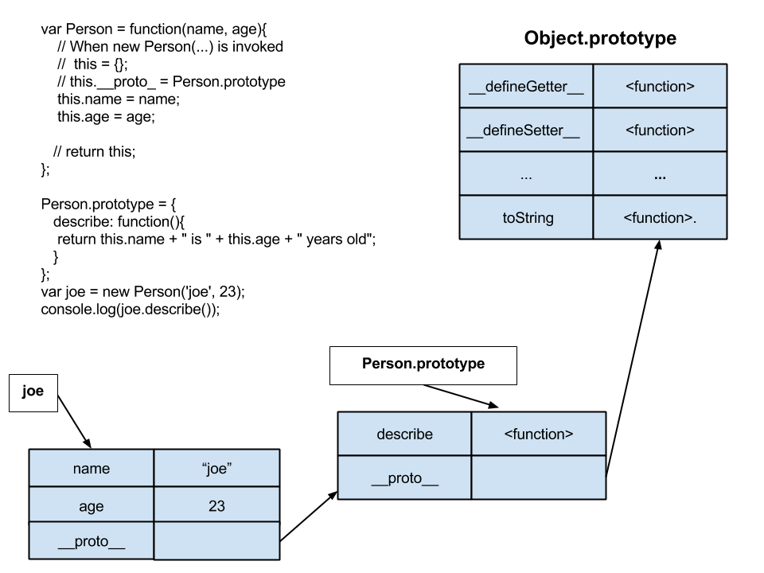

## Object Oriented Javascript

Unlike many other languages, (Ruby, Java, Smalltalk), javascript does not provide or even assume that you will be creating programs using the Object Oriented paradigm.

So, javascript doesn't provide a **class** keyword that is used in these other languages to define an Object "Factory".

But, we can emulate what is the typical behavior of the **class** keyword in other OO languages. And that typical behavior is be create an object factory.

## Objectives
* Use javascript's property lookup mechanism.
* Implement **inheritance** using Prototypical inheritance.
* Only create objects with object literal syntax when you need only one of that "type" of object.
* Create objects using a **Factory** (optional).
* Create objects using the a **Constructor** function.
* Create objects using the **Object.create** method.
* Create a **Namespace**.


## Javascript Background (optional)
[Javascript Background](JavascriptBackground.md)

## No Classes in Javascript.

Javascript does not have classes. _At least not yet, they are coming in ECMAScript 6_.

That is to say, javascript, unlike most Object-Oriented languages doesn't provide a **class** keyword that can be used to create classes.

But, it does provide a way to create structures that behave like classes. We'll see the few ways that we can create a **class** in javacript.

## Object Literals (optional)

[Object Literals](ObjectLiterals.md)

## Property Lookup.

Each object will have an internal ``__proto__`` property that can point to another object.

The ``__proto__`` is an often hidden internal property on an object. *Most browsers will let you see it tho*. By default, an object's ``__proto__`` property will point to the built-in [Object](http://goo.gl/C568wU) class.


An object's ``__proto__`` pointer will be used to lookup properties and methods.

**Create a file js/property_lookup.js and reference it from index.html**

```javascript
var joe = {
  name: "Joe Smoe",
  age: 23
}
debugger;

console.log(joe.valueOf());
```



For the example above, when one calls joe.valueOf().


* js will look for the property valueOf in the joe object literal.
* It will __not__ be found.
* js will look for the property valueOf in the object pointed to by ``joe.__proto__``.
>>	_This is the Object.prototype, another words the Object class._

* js will find the valueOf method on Object.prototype and execute it.

**WARNING!! Each object also has a prototype property. These is NOT the same as the `__proto__` property.**

## Protypical inheritance

By setting this ``__proto__`` property we can use object inheritance.

__Create a file js/simple_prototype.js with the below code and reference it from index.html.__

```
var person = {
    type: 'person',
    sayHi: function(msg){
      return this.name + " says " + msg;
    }
};

debugger;
// Check the __proto__ property of person
// It should point to the Object.prototype

// In the console enter person.valueOf()
// The method will be found by following the object pointed to by the __proto__ property.

// Create an Object literal representing one person.
var joe = {
  name: "Joe Smoe",
  age: 23,
  // Property value is a function
  describe: function(){
    return this.name + " is " + this.age + " years old";
  }
};

console.log("Hey " + joe.name + " are you really " + joe['age'] + " years old?");

debugger
joe.__proto__ = person;

// The sayHi property for joe will be found by following joe's
// __proto___ property.
console.log(joe.sayHi("hey there"));
```




For the example above:
* When one calls joe.sayHi("hey there").
* js will look for the property sayHi in the joe object literal.
* It will not be found.
* js will look for the property sayHi in the object pointed to by ``joe.__proto__``. This is the person object.
* js will find the sayHi method on the person object and execute it.

### Use Object Literals for objects that are only created once.

What if we want to create a lot of people?

We will have to create lots of object literals and each time a property or method changes we'll have to change each object literal in the program. _Makes maintainence very difficult and the code not DRY_

For example, we want to change each person to have an occupation
that is shown in the describe function?

Use Object literals for instances that will exist only once in your application. Sometimes you'll hear a single object referred to as a **Singleton**.

For example,if you have only one  Company or Team in you app then create only one instance of it.

Later, we will see how to emulate a class in Javascript that will be used to creates instances, objects, of something. One way to think about a class is that it's a *Factory* that produces objects.


## Object Creation Patterns.

The problem with Object Literals is that they can get very tedious. For example, if we have to create a new object literal for each Person and there are many people.

Or I may want to add a property or change a method for a person then I MUST do this for every single person in the app!

__Use Object Literals for objects that are only created once.__

Let's look at some ways we can create Objects.

* Factory Pattern
* Constructor Function
* ECMAScript 5 Object.create


### The Factory Pattern (optional).

The Factory Pattern will use a function to create object literals. The arguments to the factory function will be used to initialize and set the object being created.

[Factory Pattern](FactoryPattern.md)


## Lab (optional)

Redo the Sponge Bob code using the Factory pattern.

## Demo

### The Constructor Function Pattern.

This is the most common way to create objects in Javascript. It's the most common way to implement classes. We'll be using a **Constructor Function** and the javascript **new** keyword to create objects.

Many environments, including browsers, are optimized to use this kind of constructor function. The *convention* is to camelcase the name of a function that will be used as a constructor.


__Create a file js/constructor_function.js with the below code and reference it from index.html.__


```
debugger;

// Constructor Function object creation
// Constructor function is camel cased by convention.
var Person = function(name, age){
  // When new Person(...) is invoked
  // this = {};
  // this.__proto_ = Person.prototype
  debugger;

  this.name = name;
  this.age = age;

  // return the this pointer
  // return this;
};

Person.prototype = {
   describe: function(){
    return this.name + " is " + this.age + " years old";
   }
};

var joe = new Person('joe', 23),
  jill = new Person('jill', 32);

console.log(joe.describe());
console.log(jill.describe());
```

__BIG NOTE:__ The _``__proto__``_ property is NOT the same as the _``prototype``_ property.
The ``__proto__ `` property is __ONLY__ used for object property lookup.
The ``Function.prototype`` property will only exist for functions.

##### Property Lookup and the Prototype.

Whats happening when we call joe.describe().

For the example above:
* When one calls joe.describe();
* js will look for the property describe in the joe object literal.
* It will not be found.
* js will look for the property describe in the object pointed to by ``joe.__proto__``. This is the Person.prototype object.
* js will find the describe method on the Person.prototype object and execute it.





__Run the above code and look at the Person.prototype and object ``__proto__``  properties.__


## LAB
__Create a file js/cars.js__

* Create a Car Constructor Function.
* Each car object will have a make, model and year.
* Each car will have a display method that will return a string describing that car.
* Namespace the Car Constructor Function.


## Demo Object.create (optional)

ECMAScript 5 defined a new way to create an object. Object.create(...).

You will be seeing this more as time goes on and developers make use of this. For now, we will be using the Constructor Function to create objects.

[Object.create](ObjectCreate.md)

## Using Object Literals to create a Namespace.

Javascript namespaces are used to disambiguate names in an application. We create **namespaces** so that variable names in an application do not conflict.

Typically, name conflicts may happen when using a third-party library or plug-in. The library has a global variable named  `count`. And your program has a global variable named `count`.

If your program doesn't know about the library `count` and your code changes `count`, **the gates of hell will open and you'll be thrown into it. Gnashing teeth, etc.**

Your changing library code can cause **VERY** difficult to find errors.


__Create a file js/personAppNamespace.js__

__Note:__
_The var PersonApp = PersonApp || {}; will be set in each file that uses the namespace._

_Only the first file will actually set the PersonApp to {}. The other files will just assign PersonApp to itself._

```
// Create a PersonApp namespace.
// It's just and object literal being used as a namespace.
var PersonApp = PersonApp || {};

// Namespace an object literal
PersonApp.joe = { name: 'joe', age: 23 };

PersonApp.jill = {name: 'jill', age: 33}

PersonApp.addPerson = function(person){
  if(PersonApp.people === undefined){
    PersonApp.people = [];
  }
  PersonApp.people.push(person);
};

PersonApp.showPeople = function(){
  if(PersonApp.people === undefined){
    console.log("No People");
  }else{
    PersonApp.people.forEach(function(person){
      console.log(person.name + " is " + person.age + " yrs old");
    })
  }
};

PersonApp.addPerson(PersonApp.joe);
PersonApp.addPerson(PersonApp.jill);

PersonApp.showPeople();

```

**Look ma, no globals! Aren't you proud of me (big child like smile)**


### References
* [MDN Object Oriented Javascript](https://developer.mozilla.org/en-US/docs/Web/JavaScript/Introduction_to_Object-Oriented_JavaScript)

* __Zakas, Nicholas C. (2011-12-20). Professional JavaScript for Web Developers__
Chapter 6.
        * The Factory Pattern.
        * The Constructor Pattern
        * Constructors as Functions
        * The Prototype Pattern
        * How Prototypes Work
        * Alternative Prototype Syntax
        * Dynamic Nature of Prototypes
        * Problems with Prototypes
        * Combination Constructor/ Prototype Pattern

* [Object Playground](http://www.objectplayground.com/)
* [The Four Layers of Javascript OOP](https://www.youtube.com/watch?v=VJOTcUsD2kA&app=desktop)

## Summary.

* Object Literals should only be used when you ONLY need one instance of an object.
* Creating Objects with the Factory Pattern, or Factory method.
* Creating Objects with the new keyword and Constructor functions. __USE THIS METHOD__
* Creating Objects with Object.create(...).
* Most prevalant way to create objects is with the 'new' keyword and Constructor Functions.
* Learned about Prototypes and Prototypical Inheritance.
* Learned about property and method lookup.
